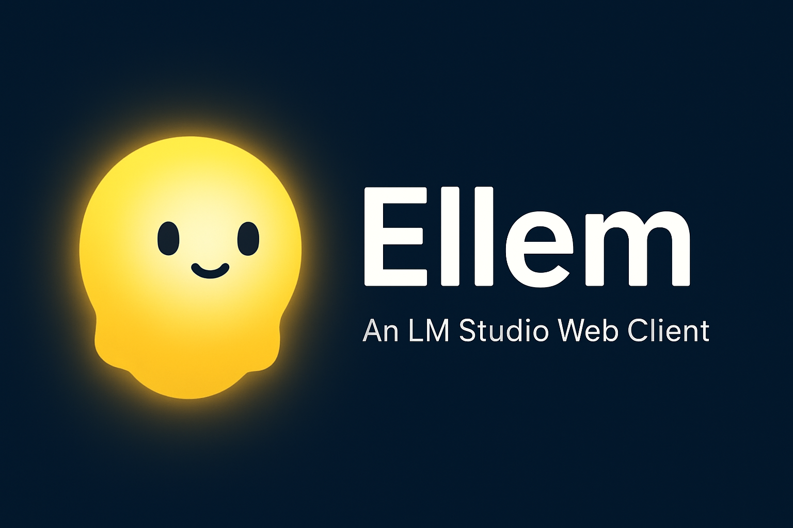

# Ellem — An LM Studio Web Client

  

Ellem is a clean, modern, browser-based chat interface for interacting with models served through **LM Studio's Local Server**. It focuses on usability, reliability, and a pleasant chat experience — without relying on any cloud services.

## ✨ Features

- 🌓 Sleek **dark mode** UI with Bootstrap 5
- 💬 Natural multi-message chat interactions
- 🚀 Supports **any model loaded in LM Studio**
- 🔄 Automatic reconnect + server status detection
- 🧠 Model list fetched dynamically from LM Studio
- 🎨 Code formatting, markdown support, and copy buttons
- 📁 Local, private, no external APIs required

## 🖥️ Requirements

- **LM Studio** installed  
- A model running in **Local Server mode**  
- Browser (Chrome, Firefox, Edge, Safari)

## 📦 Setup

1. **Start LM Studio**
2. Go to **Local Server** tab
3. Click **Start Server**
4. Load a model (preferably an *Instruct* model)
5. Note the server URL (e.g. `http://127.0.0.1:1234`)

## 🌐 Usage

1. Open Ellem in your browser
2. Enter your LM Studio Local Server URL
3. Click **Connect**
4. Select a model from the dropdown
5. Chat normally!

## 🧩 Troubleshooting

| Issue | Solution |
|------|----------|
| Model list loads but chat fails | Ensure the model is **loaded and running** in LM Studio |
| “Failed to load LLM engine” in LM logs | Switch to **CPU backend** or install **CUDA runtime** |
| Messages not formatted correctly | Ensure your model is an **Instruct/chat** variant |

## 🔒 Privacy

Ellem does **not** send your data anywhere — all inference is done **locally** on your machine.

## 📄 License

MIT — feel free to modify and extend.

---

### ❤️ Contributions

Pull requests, issues, and improvements welcome!

